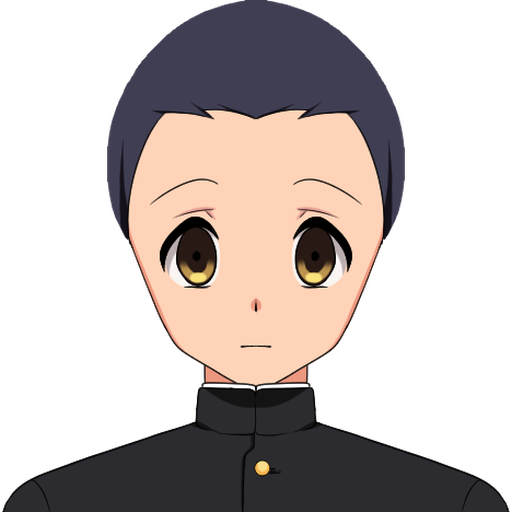
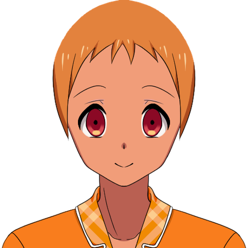
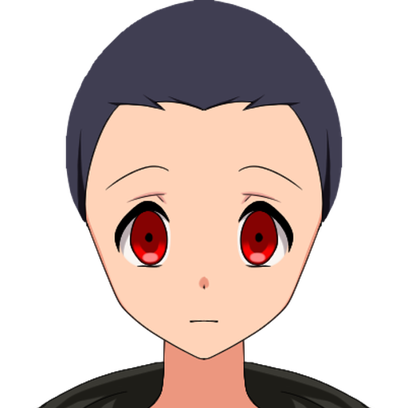
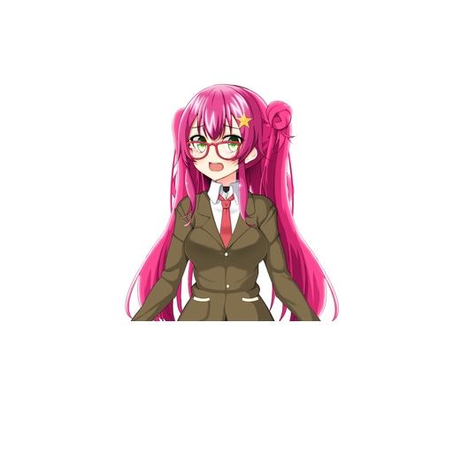
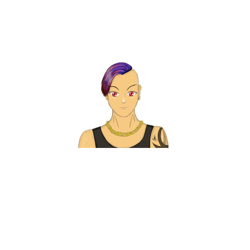
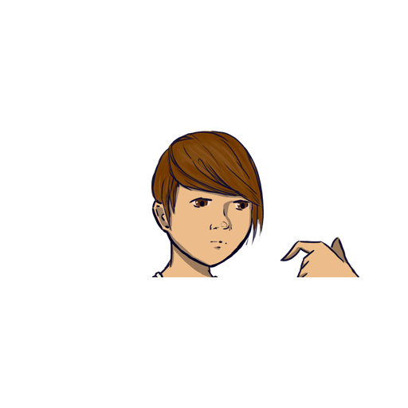
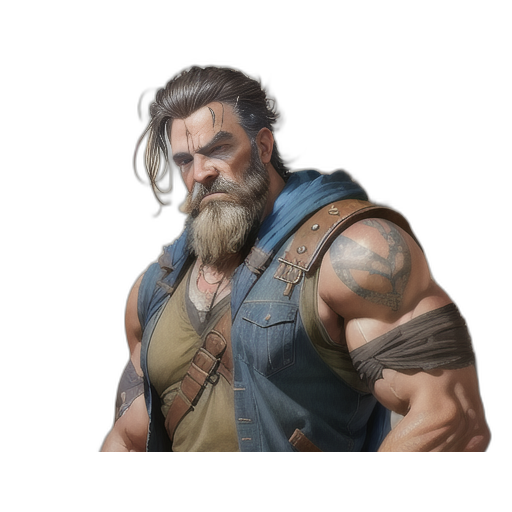
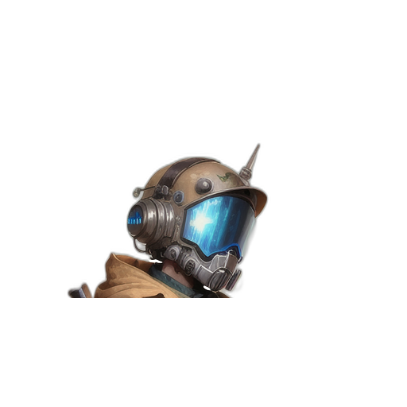

# AI-generation prompts — remaining + REPLACEMENT NPC portrait roles

**Why this file exists.** Every source pack in `public/assets/cc0-library/`
was checked for these 12 roles and none has a real professional-uniform
match (see `public/assets/cc0-library/README.md`'s "Current
placeholder-replacement status" section for the full search trace —
`male-character-sprite-creator`'s hats/clothes are stylized VN fantasy
accessories, not helmets/turnout gear/patrol uniforms;
`post-apocalyptic-portraits` is fully exhausted; web searches for a CC0
firefighter/paramedic portrait pack only turned up pixel-art/sprite-sheet
results, a style mismatch against this project's shaded VN-bust roster).
These prompts are for a human to run through an image generator (Gemini/
ChatGPT/etc.) and drop the result at the path noted per role.

**A real, honest problem found reviewing this category: there is no single
shipped art style today, and one of the three sources currently counted as
"real" is a genre mismatch, not just a style mismatch.** This project has
pulled NPC portraits from four different CC0 packs across several
sessions, and they don't agree with each other. Sorted from best to worst,
so the prompts below (and any future pass) point at the right target:

### MATCH THIS — the canonical target style
`male-character-sprite-creator`/`female-character-sprite-creator`
(Tainara-P) — clean cel-shaded VN bust, three-quarter angle, big detailed
eyes, flat neutral background, properly centered and filling the canvas.
This is also what the player's OWN base body/portrait uses, so it's the
one every NPC should converge toward.

| `civilian_male_03` | `civilian_male_04` | `civilian_nonbinary_02` |
|---|---|---|
|  |  |  |

### AVOID — shipped, but the wrong tone
`girl-sprites-premium` — bright, exaggerated anime-MASCOT register (huge
twin-tails, star hair clip, glasses, winking expression). **To be clear
about what's actually wrong here, since it matters for future prompts:
it's not the outfit or the fact that she's cute — it's the exaggeration.**
ZTH is a gamified take on real EMS, not a grim procedural — a civilian in
a sundress, a hospital APP in scrubs with a cardigan, someone in
weekend-casual clothes are all completely fair game and should show up in
the roster. The problem with this specific image is the anime-MASCOT
treatment (wink, star clip, exaggerated proportions) landing closer to a
gacha-game icon than a person you'd actually meet on a call. A civilian in
a cute sundress drawn in the MATCH THIS style below is fine and wanted;
this same civilian drawn in this pack's style is not. Don't use this pack
as a reference for new prompts, but don't read "avoid" as "avoid
cuteness" either.

| `civilian_female_01` |
|---|
|  |

### AVOID — shipped, but weak/inconsistent execution
`vn-characters-cabbit` and `og-visual-novel-style-characters` — sketchier
linework, inconsistent proportions, and both badly cropped (the subject
floats small in the upper portion of a mostly-empty canvas; one even has
a stray disembodied hand cutting in from off-frame). Don't match the
cropping/scale of these.

| `civilian_male_01` | `civilian_nonbinary_01` |
|---|---|
|  |  |

### REPLACE — currently counted as "real," but genuinely wrong
`post-apocalyptic-portraits` — used for `supervisor`/`campus_emr`/
`police_officer`/`sheriff_deputy` (8 files total: one real variant per
role/gender). This isn't a style mismatch, it's a SUBJECT mismatch:
semi-photorealistic painted post-apocalyptic/sci-fi concept art — a Mad
Max-style biker standing in for the fire supervisor, a cyberpunk gas-mask
visor helmet standing in for a police officer. Genuinely worth
regenerating even though these currently pass as "done" — see the
`supervisor`/`campus_emr`/`police_officer`/`sheriff_deputy` prompts below,
new this pass.

| `supervisor_male_01` — REPLACE | `police_officer_male_01` — REPLACE |
|---|---|
|  |  |

Every new portrait from the prompts below should look like it belongs in
the MATCH THIS lineup — same shading approach, same level of detail, same
framing — just in a different uniform.

**Shared style anchor — paste this before every prompt below**, so the
whole set reads as one cast rather than 12 unrelated images:

> Digital illustration, visual-novel character bust portrait, head and
> shoulders, facing camera, three-quarter angle. Soft cel-shading with
> clean linework, semi-realistic proportions (not anime-chibi, not
> photoreal). Neutral flat studio-gray background. Warm, slightly
> desaturated color grade. Neutral/calm expression. Square 1:1 canvas,
> subject centered and filling most of the frame, shoulders cropped at the
> bottom edge. No text, no watermark, no logo.

Save each result to `public/assets/characters/portraits/{role}_{gender}_{variant}.png`
(the file naming `portraitFor()` already expects — see `src/assets.js`).
One image per prompt below covers variant `01`; for `02`/`03`/`04`, re-run
the same prompt and ask for "a different face — different skin tone, hair,
and build, same uniform" to fill the remaining 3 variant slots per role/
gender (see `src/assets/characters/README.md`'s own note on why 4 variants
exist).

## `captain` (fire captain)
> [style anchor] + A fire department captain, structural firefighter
> turnout coat open at the collar over a navy department polo, captain's
> bugle/bar insignia visible on the collar, close-cropped hair, confident
> and weathered expression.

## `chief` (fire chief)
> [style anchor] + A fire chief in a white collared uniform shirt with
> chief's insignia (crossed bugles) on the collar, department patch on the
> shoulder, older/more senior-reading than the captain portrait, gray or
> graying hair, authoritative expression.

## `engineer` (fire apparatus engineer/driver)
> [style anchor] + A fire engineer/apparatus operator in a navy
> department t-shirt or work uniform under an open turnout coat, practical
> and focused expression, slightly grease-smudged hands optional.

## `firefighter`
> [style anchor] + A structural firefighter in full turnout gear —
> bunker coat with reflective stripes, coat collar up, no helmet (bare-
> headed for portrait framing), soot smudge optional, determined
> expression.

## `paramedic`
> [style anchor] + A paramedic in a navy or dark-blue EMS uniform polo
> with shoulder patches, stethoscope draped around the neck, name badge,
> approachable and competent expression.

## `flight_medic` / `flight_nurse`
> [style anchor] + A flight paramedic/nurse in a one-piece navy or
> orange flight suit with reflective trim, helmet held under one arm or
> absent (bare-headed for portrait framing), radio clipped to the chest
> strap, confident expression.

## `cct_physician`
> [style anchor] + A critical-care transport physician in navy flight-
> suit-style CCT uniform OR a white coat over medical scrubs (pick one and
> stay consistent across variants), stethoscope, ID badge, calm clinical
> expression.
>
> Variant note: this role doesn't need to be uniformly somber across all 4
> variants — one female/nonbinary variant wearing a light sundress or
> casual top under an open white coat (instead of scrubs) is a genuinely
> good, welcome option here. Real hospital APPs/physicians don't all dress
> identically, and a lighter, more human variant is exactly the kind of
> "not all doom and gloom" moment this project wants. Keep the white coat
> and stethoscope so the role still reads clearly.

## `cct_paramedic`
> [style anchor] + A critical-care transport paramedic in a navy CCT
> flight-suit-style uniform, more advanced-gear-forward than the base
> `paramedic` portrait (extra shoulder patches/rank tabs), focused
> expression.

## `dispatcher`
> [style anchor] + An emergency dispatcher wearing a headset with a boom
> microphone, plain collared shirt (no field uniform — this role never
> leaves the console), calm and attentive expression, faint glow of
> monitor light optional.

## `mechanic`
> [style anchor] + A fleet/apparatus mechanic in navy coveralls or a
> work shirt with a name patch, grease-stained hands and forearms, relaxed
> practical expression.

## `reporter`
> [style anchor] + A local news reporter in business-casual press attire
> (blazer, no uniform), holding a microphone with a station flag/logo
> blank or generic, polished camera-ready expression.

## Replacements for the 4 REPLACE roles above (`supervisor`, `campus_emr`,
`police_officer`, `sheriff_deputy`) — new this pass, not in the original
12-role list, because these currently pass as "done" but shouldn't.

## `supervisor` (fire/EMS shift supervisor)
> [style anchor] + An EMS or fire department shift supervisor, mid-career
> and visibly senior (not a rookie), a collared uniform shirt with a
> supervisor insignia/bar on the collar, calm and authoritative
> expression — should NOT look like `captain`/`chief` (different
> department register — this is a day-to-day shift supervisor, not
> command staff at a fire scene).

## `campus_emr`
> [style anchor] + A campus public-safety EMR in a light-blue or navy
> campus-security-style polo (not a full fire/EMS uniform — this is a
> lighter, civilian-security-adjacent role), a campus PD/safety patch on
> the shoulder, younger/more casual-reading than `paramedic`.

## `police_officer`
> [style anchor] + A municipal police officer in a real, plain patrol
> uniform (navy or black collared shirt, badge, radio mic clipped to the
> shoulder) — a REAL patrol officer, explicitly NOT sci-fi/futuristic gear
> (this replaces an existing portrait that wrongly used a cyberpunk visor
> helmet — the point of this prompt is to correct that).

## `sheriff_deputy`
> [style anchor] + A county sheriff's deputy in a tan-and-brown patrol
> uniform (distinct color from `police_officer`'s navy/black), a star
> badge, department patch on the shoulder — a real, grounded uniform, not
> post-apocalyptic/wasteland gear (same correction as `police_officer`).

## Notes
- **Tone: ZTH is meant to feel like a gamified version of real EMS, not a
  grim-and-gritty procedural.** Civilian patients/bystanders (and, per the
  `cct_physician` note above, some hospital staff) are allowed to look like
  real, varied people having an ordinary day — a cute sundress, casual
  weekend clothes, a fun hairstyle — not just somber trauma-adjacent
  outfits. The instruction from earlier in this doc to avoid
  `girl-sprites-premium`'s look is about its exaggerated ANIME-MASCOT
  execution (wink, star clip, gacha-icon proportions), not about cuteness
  itself — a sundress drawn in the MATCH THIS cel-shaded style is fine and
  wanted. Keep this in mind when filling remaining `civilian`/`campus_emr`
  variant slots: they don't all need to read as serious.
- Keep uniform SILHOUETTE distinct per role even under the shared style
  anchor (turnout coat vs. flight suit vs. EMS polo vs. plain clothes) —
  that's the one place `src/assets/characters/README.md` calls out scope-
  accuracy as visually load-bearing.
- `police_officer`/`sheriff_deputy` genuinely only have ONE real
  gender/variant slot filled today anyway (`_male_01`) — every female and
  nonbinary variant for both roles, and all 4 variants of `supervisor`/
  `campus_emr`, are STILL flat-color placeholder regardless of the REPLACE
  note above (checked directly: `police_officer_female_01.png` is a plain
  placeholder, not post-apocalyptic art). So this isn't just "swap 8
  files" — it's "the whole role needs building," same scope as any other
  role in this doc.
