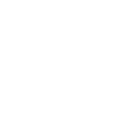

# AI-generation prompts — ICON_ART (7 remaining glyphs)

**Why this file exists.** After three passes through Kenney's CC0 icon
catalog (`game-icons`, `game-icons-expansion`, `board-game-icons` — 11/18
now real, see `public/assets/cc0-library/README.md`), these 7 concepts have
no match in any downloaded pack — confirmed by listing every file in all
three, not just grepping synonyms (round 2's synonym grep missed 3 real
matches that a full listing caught in round 3). None of the three packs is
a medical or utility icon set, so a drop/liquid, gas-pump, xp-chevron,
handshake, medical-cross, or lightning-bolt glyph genuinely isn't in any of
them. These prompts are for a human to run through an image generator.

**Reference — 4 of the 11 already-real icons in this exact style** (real
files, not mockups; shown on a dark background here only so the black
glyph is visible — the actual files are transparent):

**Shared style anchor — paste this before every prompt below**, matching
the flat single-color glyph style the 11 already-real icons use (so this
can be tinted via CSS filter, not baked-in color):

> A single flat solid-black glyph icon on a transparent background, simple
> bold silhouette shape (no gradients, no outlines-only, filled solid),
> consistent stroke weight, centered, square 1:1 canvas with a small
> margin, no text, styled to match a minimalist mobile-game icon font.

Save each result to `public/assets/icons/{key}.png` (matching `ICON_ART`
in `src/assets.js`).

## `water`
> [style anchor] + glyph: a single water droplet.

## `fuel`
> [style anchor] + glyph: a gas-pump nozzle.

## `experience`
> [style anchor] + glyph: an upward chevron/arrow inside a small circle
> (a "level up" mark).

## `relationship`
> [style anchor] + glyph: two overlapping speech bubbles, or two small
> figures side by side.

## `health`
> [style anchor] + glyph: a plus/cross inside a rounded square (a medical
> cross mark).

## `stress`
> [style anchor] + glyph: a jagged lightning-bolt-through-a-brain
> silhouette, OR a simpler cracked/zigzag line motif — pick whichever
> reads clearly as a small solid glyph.

## `energy`
> [style anchor] + glyph: a lightning bolt.
